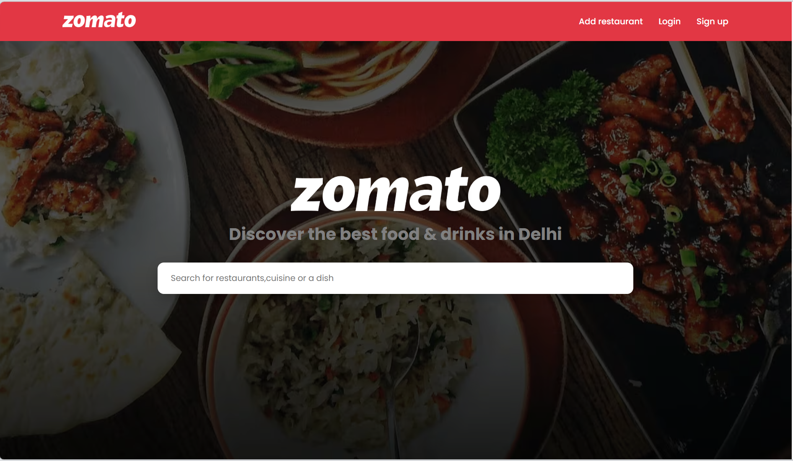
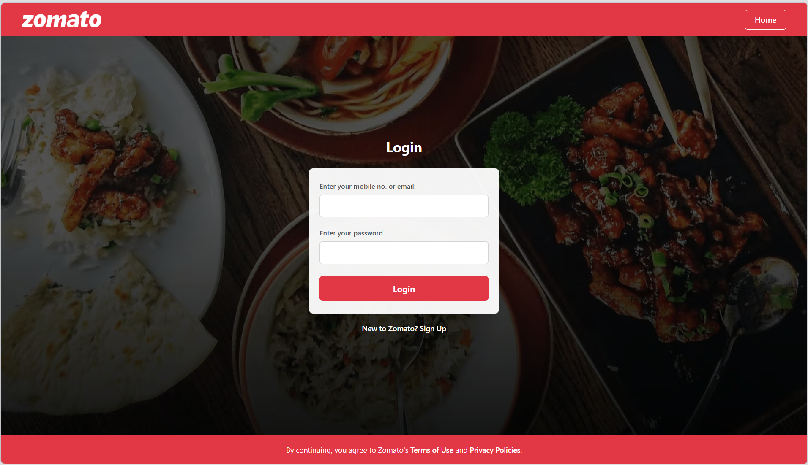
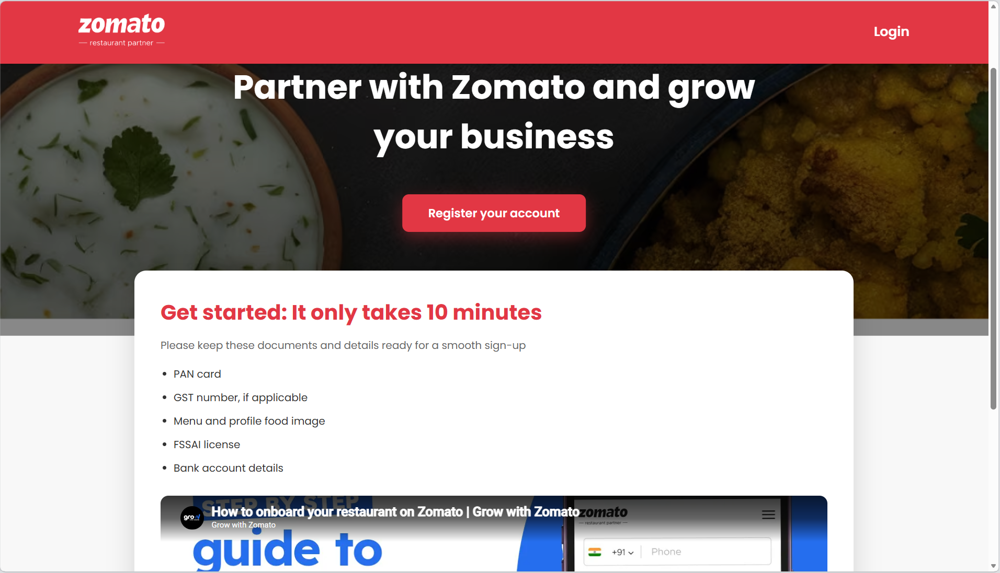
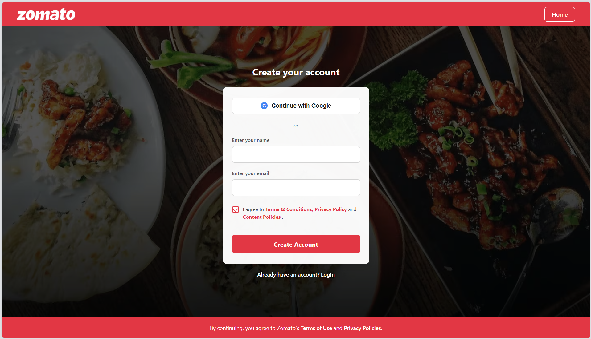

# Zomato Clone 🍕

A frontend clone of the Zomato website created using **HTML, CSS, and JavaScript**.

This project is a food delivery website interface inspired by Zomato, including multiple webpages, restaurant sections, food images, and a user-friendly layout.

## Technologies Used

- HTML5
- CSS3
- JavaScript
- AI tools for guidance, debugging, improving design ideas, and development assistance

## Features

- Zomato-inspired homepage design
- Restaurant listing section
- Add restaurant page
- Login and signup pages
- Food and background images
- Multiple linked webpages
- Custom CSS styling
- JavaScript interactions
- Organized project structure

## Screenshots

### Home Page

### Login Page

### Add Restaurant Page

### Sign Up Page

## Project Structure

Zomato-clone
│
├── CSS
│ ├── style.css
│ ├── style2.css
│ ├── style3.css
│ └── style4.css
│
├── JS
│ ├── script.js
│ ├── script2.js
│ ├── script3.js
│ └── script4.js
│
├── Images
│ └── Website images and assets
│
├── Screenshots
│ └── Project screenshots
│
├── HTML Files
│ ├── index.html
│ ├── login.html
│ ├── signup.html
│ ├── add_restaurant.html
│ └── investor_relation.html
│
├── bg.png
├── bg2.png
│
└── README.md

## Learning Outcome

Through this project, I practiced building a complete frontend website using HTML, CSS, and JavaScript. I learned about webpage structure, styling, layouts, linking multiple pages, and organizing project files properly.

I also used AI tools during development to understand concepts, get coding guidance, improve styling ideas, debug issues, and enhance different parts of the project.

## Author

Pranjal Kohli
